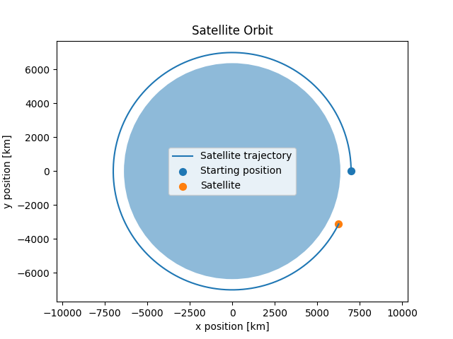

# Orbital Mechanics Simulation
Numerical simulation of orbital motion using Python.

## Objective
This project simulates the motion of a satellite orbiting Earth under the influence of Earth's gravity.

## Physical Model
The satellite is modeled as a point mass moving under the gravitational attraction of Earth. This gravitational acceleration is calculated using Newton's law of universal gravitation:
$$
\vec{a} = -\frac{GM}{r^3}\vec{r}
$$
where $G$ is the gravitational constant, $M$ is the mass of Earth, and $r$ is the distance between the satellite and the centre of Earth.

## Numerical method
The equations of motion are integrated numerically using a time step of 1 second.
At each time step, the gravitational acceleration is calculated from the satellite's current position. The velocity is then updated, followed by the position.

## Initial Conditions
| Parameter | Value |
|---|---:|
| Initial distance from Earth'scenter | 7000 km |
| Initial velocity | 7546 m/s |
| Time step | 1 s |
| Simulation time | 5400 s|

## Results
The simulation produces a nearly circular orbit with the following values:
| Quantity | Result |
|---|---:|
| Final speed | 7544.18 m/s |
| Theoretical circular speed | 7545.95 m/s |
| Speed difference | -1.77 m/s |
| Theoretical orbital period | 97.14 min |
| Final altitude | 630.69 km |
| Specific mechanical energy | -2.85 × 10⁷ J/kg |
The simulated final speed differs from the theoretical circular speed by only about 1.77 m/s, indicating that the numerical simulation remains very close to the expected circular orbit.

## Visualization
The plot below shows the simulated satellite trajectory, together with the initial and final satellite positions and the Earth.

## Future Improvements
- Improve the numerical integration method.
- Simulate different types of orbits, including elliptical and escape trajectories.
- Compare numerical results with analytical predictions.
- Investigate numerical errors and their dependence on the time step.